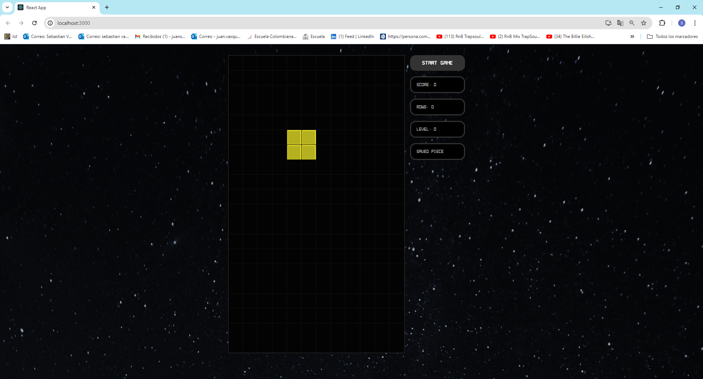

# Tetris Co-op

This is a Tetris game built with React using hooks like `useState`, `useEffect`, and custom hooks for game logic.

## Getting Started
Download the project from 
[the repository.](https://github.com/Sebasvasquezz/Tetris-Co-op)

### Prerequisites

* [Maven](https://maven.apache.org/): Automate and standardize the life flow of software construction

* [Git](https://www.git-scm.com/): Decentralized Configuration Manager

* [Node](https://nodejs.org/en/): A JavaScript runtime built on Chrome's V8 engine, enabling server-side scripting and development of scalable network applications.

### Installing
1. Maven
    * Download Maven in http://maven.apache.org/download.html
    * You need to have Java installed (7 or 8)
    * Follow the instructions in http://maven.apache.org/download.html#Installation

2. Git
    * Download git in https://git-scm.com/download/win
    * Follow the instructions in https://git-scm.com/book/en/v2/Getting-Started-Installing-Git

3. Node
    * Download Node in https://nodejs.org/en
    * Follow the instructions in https://nodejs.org/en/learn/getting-started/how-to-install-nodejs

### Build the project

1. Clone the repository:
    ```bash
    git clone https://github.com/Sebasvasquezz/Tetris-Co-op
    ```
2. Navigate to the project directory:
    ```bash
    cd tetris-game
    ```
3. Install the dependencies:
    ```bash
    npm install
    ```

## Usage

1. Start the development server:
    ```bash
    npm start
    ```
2. Open your browser and go to `http://localhost:3000`.


## Features

- Classic Tetris gameplay
- Score tracking
- Level progression
- Game over detection
- Save and swap tetromino piece functionality

## Game Controls

- **Left Arrow / A**: Move piece left
- **Right Arrow / D**: Move piece right
- **Down Arrow / S**: Move piece down faster
- **Up Arrow / W**: Rotate piece
- **Space**: Drop piece to the bottom
- **C**: Save and swap tetromino piece

## Built With

* [Maven](https://maven.apache.org/) - Dependency management
* [Node](https://nodejs.org/en/) - JavaScript runtime for building scalable network applications.

## Authors

* **Juan Sebastian Vasquez Vega**  - [Sebasvasquezz](https://github.com/Sebasvasquezz)

## Date

June 03, 2024


## License

This project is licensed under the GNU License - see the [LICENSE.txt](LICENSE.txt) file for details.

