# Tetris Co-op

This project is a real-time multiplayer Tetris game where players can compete against each other. The objective is to achieve the highest score by clearing as many lines as possible. The game supports multiple players and includes features such as real-time communication, scoring, and ranking.

### Key Features
- **Real-time Multiplayer:** Support for multiple players in a shared game environment.
- **Scoring System:** Players earn points by clearing lines. The scores are recorded and ranked.
- **Real-time Communication:** Players interact with the game server and each other via WebSockets.
- **Dynamic Game State:** The game state is updated and synchronized across all players in real-time.
- **Random Tetromino Generation:** Tetrominoes are randomly generated and sent to players.
- **Move and Rotation:** Players can move and rotate Tetrominoes.

### Game Controls

- **Left Arrow / A**: Move piece left
- **Right Arrow / D**: Move piece right
- **Down Arrow / S**: Move piece down faster
- **Up Arrow / W**: Rotate piece
- **Space**: Drop piece to the bottom

## Getting Started
Download the project from [the repository](https://github.com/Sebasvasquezz/Tetris-Co-op).

You can also clone the file using the following command:
```
git clone https://github.com/Sebasvasquezz/Tetris-Co-op.git
```

### Prerequisites

* [Maven](https://maven.apache.org/): Automate and standardize the life flow of software construction

* [Git](https://www.git-scm.com/): Decentralized Configuration Manager

* [Node](https://nodejs.org/en/): A JavaScript runtime built on Chrome's V8 engine, enabling server-side scripting and development of scalable network applications.

* [Docker](https://docs.docker.com/):  Platform that allows developers to automate the deployment of applications inside lightweight, portable containers.

### Installing
1. Maven
    * Download Maven in http://maven.apache.org/download.html
    * You need to have Java installed (7 or 8)
    * Follow the instructions in http://maven.apache.org/download.html#Installation

2. Git
    * Download git in https://git-scm.com/download/win
    * Follow the instructions in https://git-scm.com/book/en/v2/Getting-Started-Installing-Git

3. Node
    * Download Node in https://nodejs.org/en
    * Follow the instructions in https://nodejs.org/en/learn/getting-started/how-to-install-nodejs

4. **Docker**
    - Install Docker by following the instructions https://docs.docker.com/get-docker/

### Build the project

Once you have the cloned project in your repository. Follow the steps below to launch the program successfully.

#### Run BackEnd Spring-boot

1. Open a terminal and enter the folder where you cloned the repository and enter the `ProyectoBack` folder.

2. Use the following command to remove files generated in previous builds, compile the code, and package the project into a JAR or WAR file ready for distribution.
    ```
    mvn clean package
    ```
3. Now you can run the project using the following command:

    ```
    mvn spring-boot:run
    ```

#### Run FrontEnd React Js

1. Open a terminal, navigate to the folder where the repository was cloned, and enter the `ProyectoReact` folder.

2. Use the following command to install dependencies:
    ```
    npm install
    ```

3. Now use the following command to start the project:
    ```
    npm start
    ```

4. Now open a browser and go to the following [link](https://localhost:8443/) to login:

    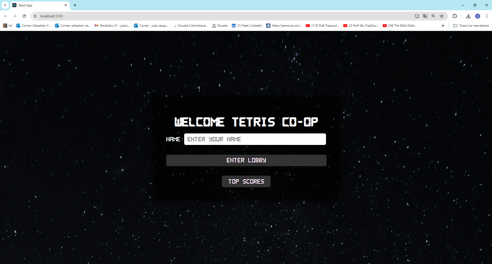

5. Enter your name and click the enter lobby button:

    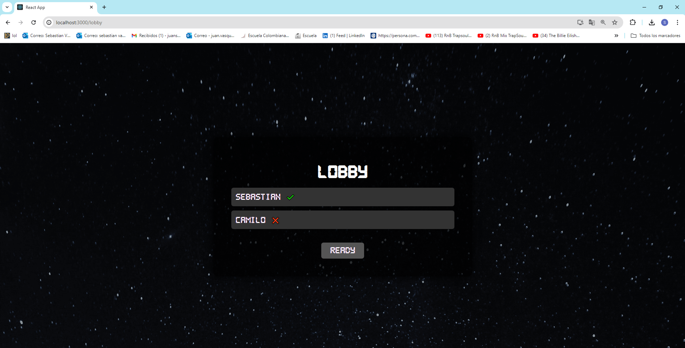

6. Click on the ready button, when all the players are ready the game will start:
    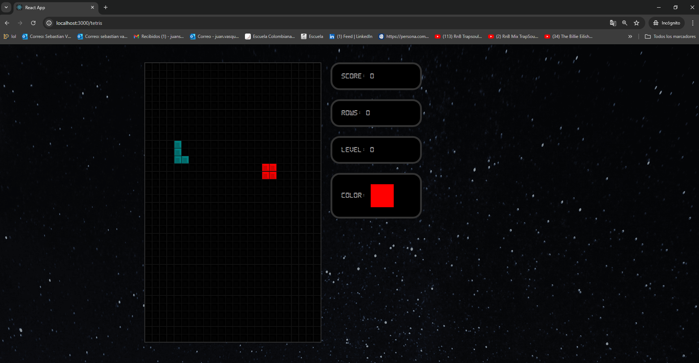

5. You can also open a browser and go to the following [link](http://ec2-3-80-69-28.compute-1.amazonaws.com:3000/) (the url can change over time) to access the project on AWS:

    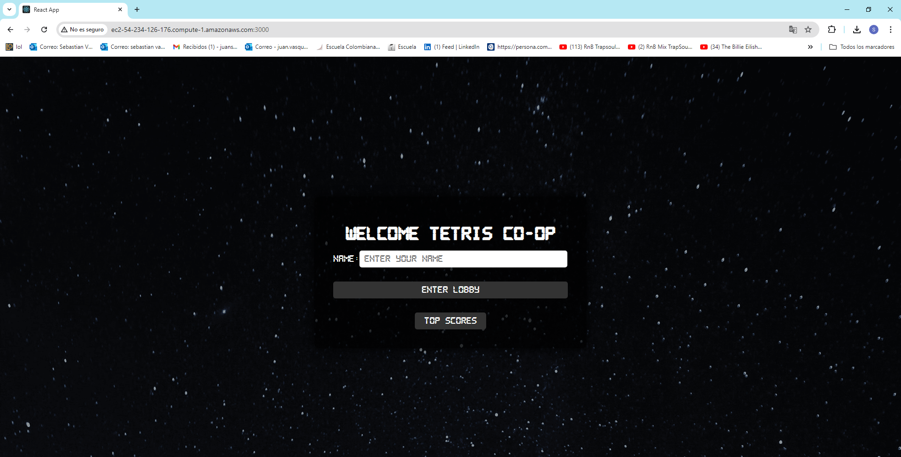

## Running the tests

Unit tests were carried out through Junit in order to verify the functionality of the implemented methods and systems.

Once the repository is downloaded, open a command prompt and run the following command to run the unit tests:

```
mvn test
```
The execution:

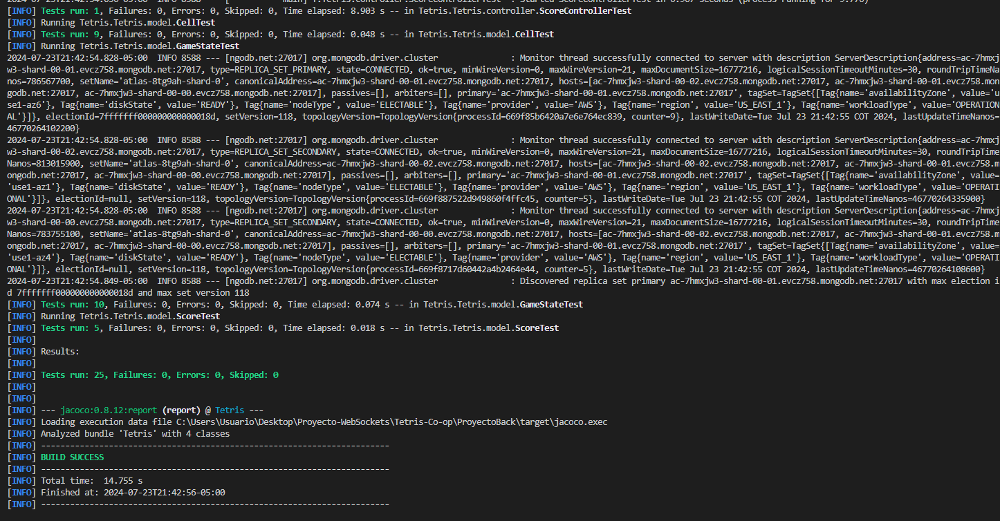

1. Run the containers in Docker with the following commands.
    ```
     docker pull sonarqube
    ```
    ```
     docker run -d --name sonarqube -e SONAR_ES_BOOTSTRAP_CHECKS_DISABLE=true -p 9000:9000 sonarqube:latest
    ```
    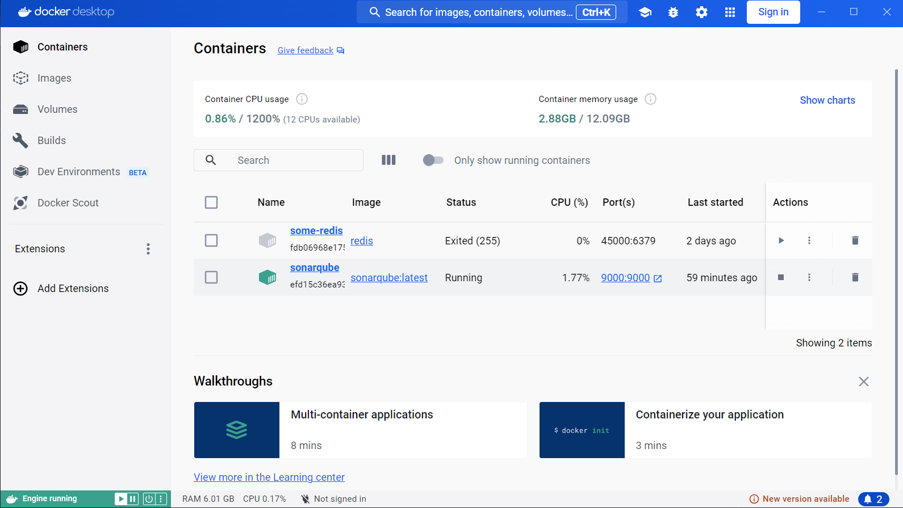

2. Then to see the coverage with Jacoco and Sonar.
    + Log in to sonar localhost:9000 change the password, the default username and password is admin.

    + Enter the account options.

    + Once the sonar is running, you must generate a token

    + Run the following command:
    ```
    mvn verify sonar:sonar -D sonar.token=[GENERATED_TOKEN]
    ```
    Now you enter the following path to see the JaCoCo report:
    ```
     target/site/jacoco/index.html
    ``` 

    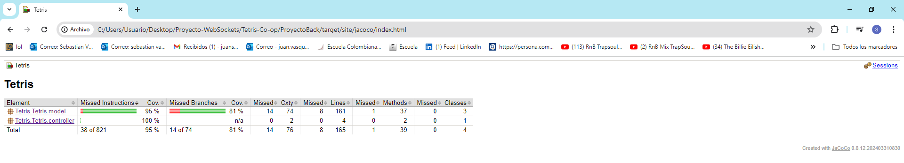

    Now we enter the following link to see Sonar:

    http://localhost:9000/projects
 
    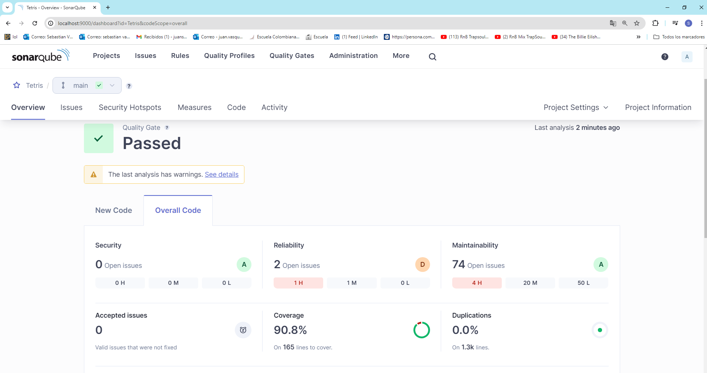
## Project Structure

### BackEnd Spring-boot

- **TetrisApplication.java:** Main application class for the Spring Boot application.

- **Config:**
   - **WebSocketConfig:** This class enables WebSocket and registers WebSocket handlers.

- **Controller:**
    - **GameWebSocketHandler:** This class manages player connections, game state, and interactions via WebSocket.
    - **ScoreController:** This controller provides endpoints to retrieve and manage player scores.

- **Model:**
    - **GameState:** Manages the game state, including the game board and player Tetrominoes.
    - **Cell:** Represents a cell in the game board.
    - **Score:** Manages player scores and attributes.
    - **Tetrominos:** Defines the Tetromino shapes and their rotations.

- **Repository:**
    - **ScoreRepository:** This interface provides methods for interacting with the Score collection in MongoDB.

### FrontEnd React Js

- **Tetris.js:** Component that handles the game logic and renders the game.
- **Lobby.js:** Component that displays the game lobby.
- **Login.js:** Component that handles login.

## Architectural Design

### Class Diagram

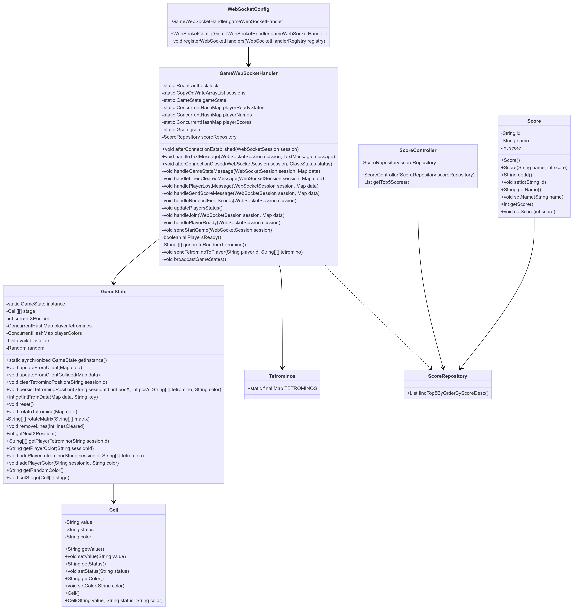

#### Diagram Description

+ **WebSocketConfig:** Configures and registers WebSocket handlers.
+ **GameWebSocketHandler:** Manages WebSocket connections, game state, and interactions.
+ **ScoreController:** Handles score-related requests and interactions with the score repository.
+ **Cell:** Represents a cell in the game board, including its value, status, and color.
+ **GameState:** Manages the game state, including the game board, player Tetrominoes, and colors.
+ **Score:** Represents a player's score, including attributes like id, name, and score value.
+ **Tetrominos:** Defines the Tetromino shapes and their rotations.
+ **ScoreRepository:** Provides methods for interacting with the Score collection in MongoDB.

### Architecture Diagram

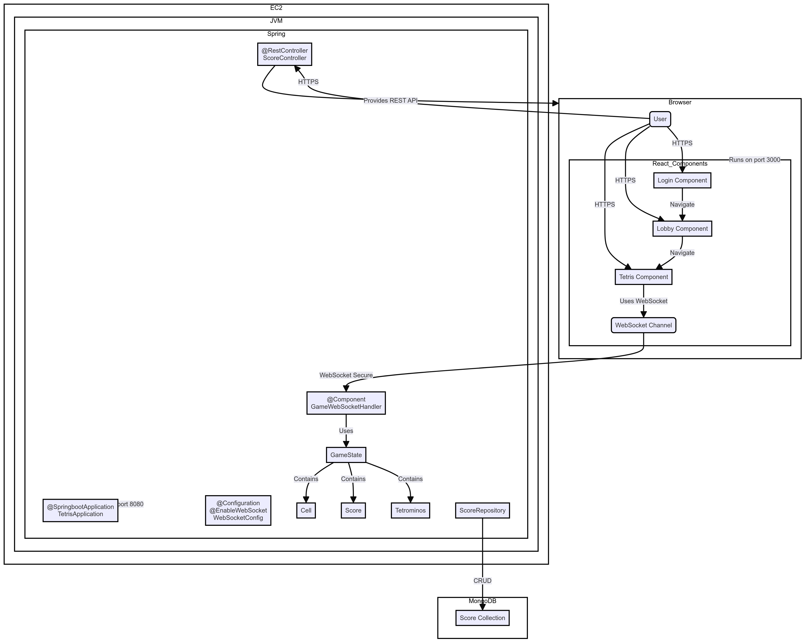

#### Architecture Diagram Description

+ **Browser**

    + **User:** Represents the user interacting with the application through the browser.
    + **Login Component:** React component that handles the login process.
    + **Lobby Component:** React component that displays the game lobby.
    + **Tetris Component:** React component that handles game logic.
    + **WebSocket Channel:** WebSocket channel used for real-time communication between the client and the server.

+ **EC2/JVM/Spring**  

    + **TetrisApplication:** Main application class for the Spring Boot application.
    + **WebSocketConfig:** Configuration of WebSocket to enable and register WebSocket handlers.
    + **GameWebSocketHandler:** Component that manages WebSocket connections, game state, and interactions.
    + **ScoreController:** REST controller that handles score-related requests.
    + **GameState:** Manages the game state, including the game board and player Tetrominoes.
    + **Cell:** Represents a cell in the game board.
    + **Score:** Manages player scores and attributes.
    + **Tetrominos:** Defines the Tetromino shapes and their rotations.
    + **ScoreRepository:** Repository that interacts with the MongoDB database to perform CRUD operations on scores.

+ **MongoDB** 

    + **ScoreData:** Collection in MongoDB that stores player scores.

**Communication Flows**

+ The user communicates with the React components via HTTPS.
+ The React components (Login, Lobby, Tetris) allow navigation and updating the game state.
+ The Tetris Component uses a WebSocket channel (WSChannel) to communicate with the GameWebSocketHandler on the server, ensuring real-time communication.
+ The REST controllers (ScoreController) provide REST APIs that the React components can use to retrieve and send data.
+ The ScoreRepository interacts with the MongoDB database to perform CRUD operations on scores.
+ TetrisApplication runs the Spring Boot application on port 8080.
Browser runs the React components on port 3000.

### Deployment Diagram

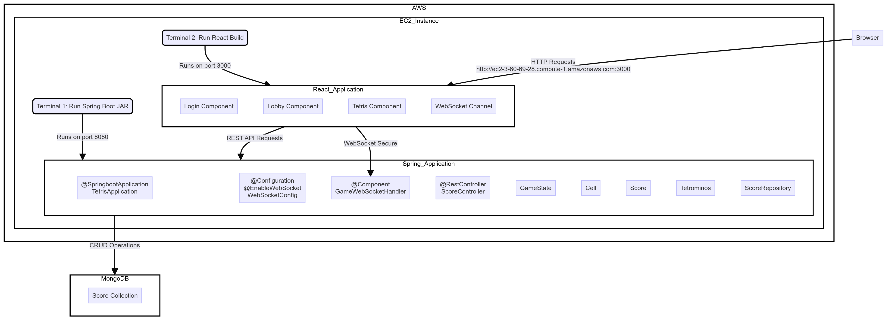

#### Deployment Diagram Description

**AWS/EC2_Instance**

+ **Terminal 1:** Runs the Spring Boot application (JAR) on port 8080.
+ **Terminal 2:** Runs the built React application on port 3000.

**Spring Application:**
+ **AppStarter:** Main class that starts the Spring Boot application.
+ **WebSocketConfig:** Configuration of WebSocket to enable and register WebSocket handlers.
+ **GameWebSocketHandler:** Component that manages WebSocket connections, game state, and interactions.
+ **ScoreController:** REST controller that handles score-related requests.
+ **GameState:** Manages the game state, including the game board and player Tetrominoes.
+ **Cell:** Represents a cell in the game board.
Score:** Manages player scores and attributes.
+ **Tetrominos:** Defines the Tetromino shapes and their rotations.
+ **ScoreRepository:** Repository that interacts with the MongoDB database to perform CRUD operations on scores.

**React Application:**
+ **Login Component:** React component that handles the login process.
+ **Lobby Component:** React component that displays the game lobby.
+ **Game Component:** React component that handles game logic.
+ **WebSocket Channel:** WebSocket channel used for real-time communication between the client and the server.

**MongoDB:**
+ **ScoreData:** Collection in MongoDB that stores player scores.
## Built With

* [Maven](https://maven.apache.org/) - Dependency management
* [Node](https://nodejs.org/en/) - JavaScript runtime for building scalable network applications.

## Authors

* **Juan Sebastian Vasquez Vega**  - [Sebasvasquezz](https://github.com/Sebasvasquezz)

## Date

Jule 24, 2024


## License

This project is licensed under the GNU License - see the [LICENSE.txt](LICENSE.txt) file for details.

